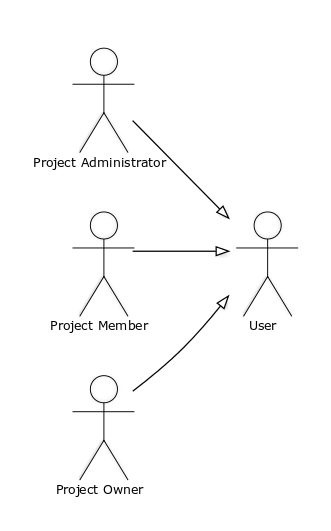

# A2: Actors and User stories

This artifact contains the specification of the actors and their user stories, serving as agile documentation of requirements for our Project Management Web Application.

## 1. Actors

For the **project management**, the actors are represented in the figure below and described in the table.

Figure 1: Actors.

Figure 2: User roles.

| Identifier | Description | Example |
|:----------:|:------------|:--------|
| User | Generic user, can create and contribute to projects | Projects developers and contributors |
| Visitor | Unauthenticated user, can see public projects but can't contribute to any of them | n/a |
| Administrator | Authenticated user, can manage users and projects | Admin |
| OAUTH | OAUTH API's will be used to register and authenticate into the system. | Google/Facebook/Amazon/Microsoft/Twitter/etc... account|

Table 1: Actor's description.

| Identifier | Description | Example |
|:----------:|:------------|:--------|
| Project Owner | Have all the project permissions, can delete the project and manage coordinators | A project creator |
| Project Manager | Can manage all team members and tasks | A project supervisor |
| Project Member | Can contribute to projects, creating and solving tasks | A project member |

Table 2: User's roles.

## 2. User Stories

### 2.1. Visitor

| Identifier | Name | Priority | Description |
| :----------:|:--------------|:---------:|:------------|
| US01 | Log in | high | As a Visitor, I want to authenticate into the system, so that I can access privileged information.  |
| US02 | Register | high | As Visitor, I want to register myself into the system, so that I can authenticate myself into the system.  |
| US03 | Home Page | high | As a Visitor, I want to access home page, so that I can see a brief website's description.  |
| US04 | About page | high | As a Visitor, I want to access about page, so that I can see the complete information about the website. |
| US05 | FAQ page | high | As a Visitor, I want to access FAQ page, so that I can get answers to most frequently asked questions. |
| US06 | Contact page | high | As a Visitor, I want to access contact page, so that I can have ways to contact the owner if I want to.|
| US07 | Projects page | high | As a Visitor, I want to access projects page, so that I can see public projects.|
| US08 | API Log in | low | As a Visitor, I want to authenticate into the system using a third party service, such as Google or Facebook.|
| US09 | API Register | low | As a Visitor, I want to register myself into the system using a third party service, such as Google or Facebook.|

Table 3: Visitor's user stories.

### 2.2. User

| Identifier | Name | Priority | Description |
| :----------:|:-------------:| :-----:|:-------|
| US10 | Search projects | high | As an User, I want to search through the projects that are open to me, so that I can see which one i want to contribute the most.|
| US11 | Edit profile | high | As an User, I want to change my personal information, so that I can keep it updated (e.g. changing the password).|
| US12 | Create project | high | As an User, I want to be able to create a project, so that I can use the website service.|
| US13 | Statistics | low | As an User, I want to check usage statistics (for example the user that has contributed the  most to a project), so that I can stay informed.|

Table 4: User user's stories.

### 2.2.1 Project Member

| Identifier  | Name          | Priority  | Description |
| :----------:|:-------------:| :-----:|:-------|
| US14 | Create Task | high | As a project member, I want to be able to add a task to the task list, so that we can keep improving the project.|
| US15 | Edit My Tasks | high | As a project member, I want to edit a task to the task list, so that I can better convey what is needed.|
| US15 | Commentate Task | medium | As a project member, I want to be able to comment a task, so that i can provide my insight.|
| US16 | Search tasks | high | As a project member, I want to search through the different tasks, so that i can find one that is best suited for me.|
| US17 | Ask to close task | medium | As a project member, I want to be able to signal that a task has been completed, so that the project administrator can close it.|
| US18 | Chat in the forum | medium | As a project member, I want to be able to chat in the forum, so that i can contribute to the project via the discussion forum.|

Table 5: Project Member's user stories.

### 2.2.2 Project Administrator

| Identifier  | Name          | Priority  | Description |
| :----------:|:-------------:| :-----:|:-------|
| US19 | Close Task | high | As a project administrator, I want to be able to fully close tasks that have been completed, so that they don't clutter the task list.|
| US19 | Edit tasks | high | As a project administrator, I want to edit a task, so that i can better convey what is needed.|
| US20 | Manage project member | medium | As a project administrator, I want to be able to add & remove project members, so that they can contribute to our project.|

Table 6: Project Administrator's user stories.

### 2.2.3 Project Owner

| Identifier  | Name          | Priority  | Description |
| :----------:|:-------------:| :-----:|:-------|
| US21 | Transfer Ownership | medium | As a project owner, I want to be able to transfer ownership of a project, so that I am no longer burdened by it.|
| US22 | Manage project administrators| medium | As a project owner, I want to be able to add & remove project administrators, so that they can help me delegate and moderate the project.|
| US23 | Delete project | low | As a project owner, I want to be able to delete a project, so that a dead project no longer shows up in my projects.|

Table 7: Project Owner's user stories.

### 2.2.3 Website Administrator

| Identifier  | Name          | Priority  | Description |
| :----------:|:-------------:| :-----:|:-------|
| US24| Delete Projects | high | As a Website Administrator, I want to delete projects with inappropriate content, so that I can moderate all the information.|
| US25| Remove Comments | high | As a Website Administrator, I want to remove comments with inappropriate content/expressions, so that I can moderate all the texts.|
| US26| Promote User     | high | As an Website Administrator, I want to promote a regular user to a premium one, so that he can access restricted website functionalities.|
| US27| Ban User        | high | As an Website Administrator, I want to record the inactivity of a system user, so that he can't longer access restricted contents of the site.|
| US28| Maintenance     | low | As an Website Administrator, I want to be able to interrupt all activity to maintenance purposes, so that I can improve website design and functionalities.|
| US29| General Messages| low | As an Website Administrator, I want to send messages to all users, so that I can notify about maintenance or server down.|

Table 8: Website Administrator user's stories.

## A1. Annex: Supplementary requirements

### A1.1. Business rules

| Identifier | Name | Description |
| :----------:|:-------------:|:-----------|
| BR01 | Profit | Premium users have special capabilities. (ex: create private projects, etc...) |
| BR02 | User Rules | Users should follow and respect  the terms and services.|

Table 9: Business rules.

### A1.2. Technical requirements

| Identifier | Name | Description |
|:-----------:|:-------------:|:-----------|
| TR01 |Availability |The system must be available 99 percent of the time 24/7 |
| TR02 |Usability |The system should be simple and easy to use |
| TR03 |Performance |The system should have very short response times |
| TR04 |Web Application|The system should be implemented as a Web Application with dynamic pages (HTML5, JavaScript, CSS3 and PHP) |
| TR05 |Portability |The server side system should only work on Linux |
| TR06 |Database |Must use PostgreSQL database management |
| TR07 |Security |System will protect information from unauthorized access through the use of an authentication and privilege verification system (XSS, CSRF, SQL injection, Password Storage, Cross-site Scripting) |
| TR08 |Robustness |The system must be prepared to handle and continue operating when runtime errors occur |
| TR09 |Scalability |System must be prepared to deal with user base growth and corresponding operations |
| TR10 |Ethics |The system must respect the ethical principles in software development. |

Table 10: Technical requiriments.

### A1.3. Restrictions

| Identifier | Name | Description |
| :----------:|:-------------:|:----------- |
| C01 |Deadline |The system should be ready to be used at the beginning of the semester so the students can organize themselves as quickly as possible|

Table 11: Restrictions

***
<!--
## Revision history

Changes made to the first submission:
1. Item 1
1. Item 2

***
-->

GROUP43, 18/02/2018

> Mateus Pedroza Cortes Marques, up201601876@fe.up.pt   
> Bernardo Manuel Costa Barbosa, up201503477@fe.up.pt   
> João Pedro Teixeira Pereira de Sá, up201506252@fe.up.pt   
> Mário Rui Macedo Flores dos Santos, up201503406@fe.up.pt
