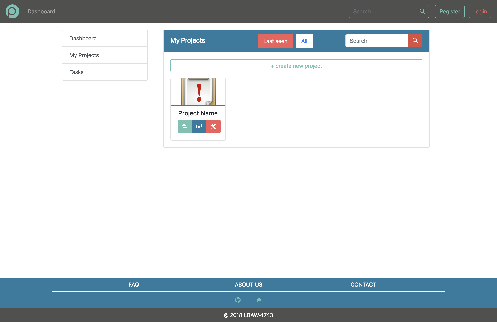
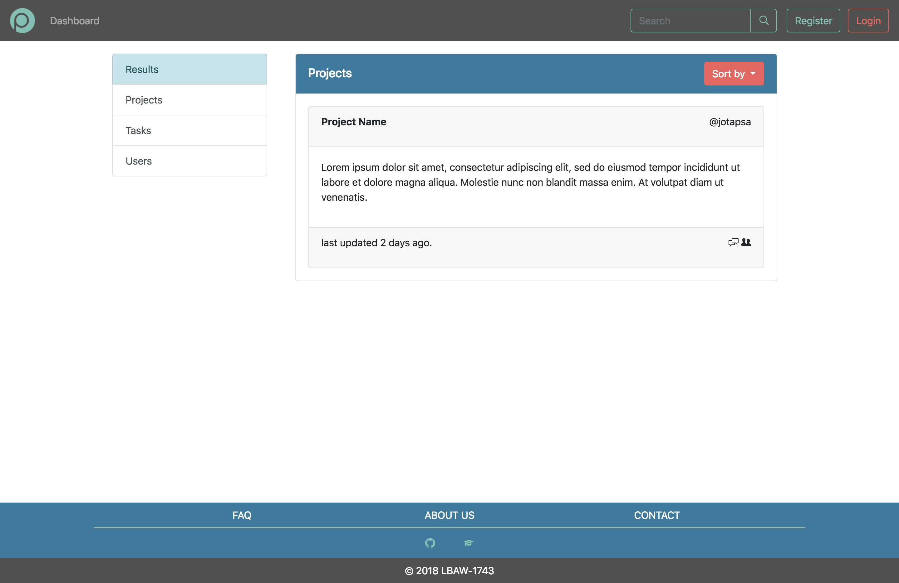
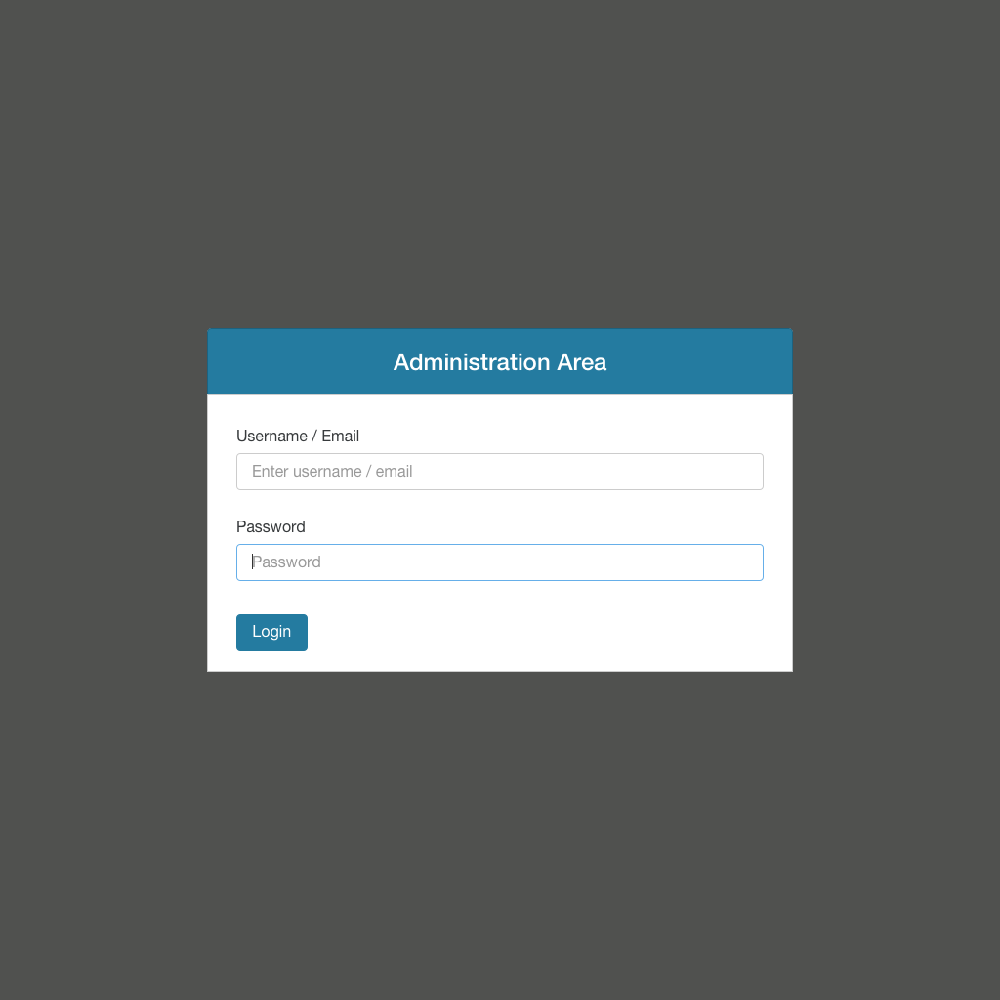

# A3: User Interface Prototype

This artifact contains the overview of the interface elements and features for our **Project Management** Web Application.

## 1. Interface and common features

**Plenum** is a web application based on HTML5, JavaScript and CSS. The user interface was implemented using the Bootstrap framework.

1.  Logo
2.  Navigation Bar
3.  Content
4.  Footer

Figure 1: Homepage of PLENUM.

In this figure some characteristics common to all the pages are highlighted:
- Color Scheme:
  - Dark Liver (#50514F);
  - Sunset Orange (#F25F5C);
  - Mustard (#FFE066);
  - Lapis Lazuli (#247BA0);
  - Green Sheen (#70C1B3);
- The common links to the various pages maintain their position to make the user experience consistent;
- User have the link to the dashboard, where he can view all his projects and tasks;
- Search any User, Project or Task;
- Responsive design to help user at any device (computer, tablet, smartphone, etc...).

## 2. Sitemap

Figure 1: Sitemap presenting the overall structure of the web application.

## 3. Storyboards

Figure 3: Log In from Home Page.

Figure 4: New Project from Dashboard.

Figure 5: Edit Profile from Dashboard.

Figure 6: Create Task from Dashboard.

## 4. Interfaces

> Screenshots, structured in subsections, including a reference, a description and a URL to the working version.

### UI01: Homepage

Figure 7: [Homepage](url).

### UI02: FAQ:

### UI03: About:

### UI04: Log In:

### UI05: Sign Up:

### UI06: Dashboard:

### UI07: Dashboard My Projects:

### UI08: Dashboard My Tasks:

### UI09: New Project:

### UI10: Project Tasks:

### UI11: Project Forum:

### UI12: Project Members:

### UI13: Project Options:

### UI14: Project Manage Tasks:

### UI15: Project Manage Users:

### UI16: Task page:

### UI17: Edit Task:

### UI18: Profile:

### UI19: Edit Profile:

### UI20: Search by Projects:

### UI21: Search by Users:

### UI22: Search by Tasks:

### UI23: Administration Log In:

### UI24: Administration Manage Projects:

### UI25: Administration Manage Users:

### UI26: Error page:

***

## Revision history

Changes made to the first submission:
1. Item 1
1. Item 2

***

GROUP1743, 05/03/2018

> Mateus Pedroza Cortes Marques, up201601876@fe.up.pt   
> Bernardo Manuel Costa Barbosa, up201503477@fe.up.pt   
> João Pedro Teixeira Pereira de Sá, up201506252@fe.up.pt   
> Mário Rui Macedo Flores dos Santos, up201503406@fe.up.pt  
