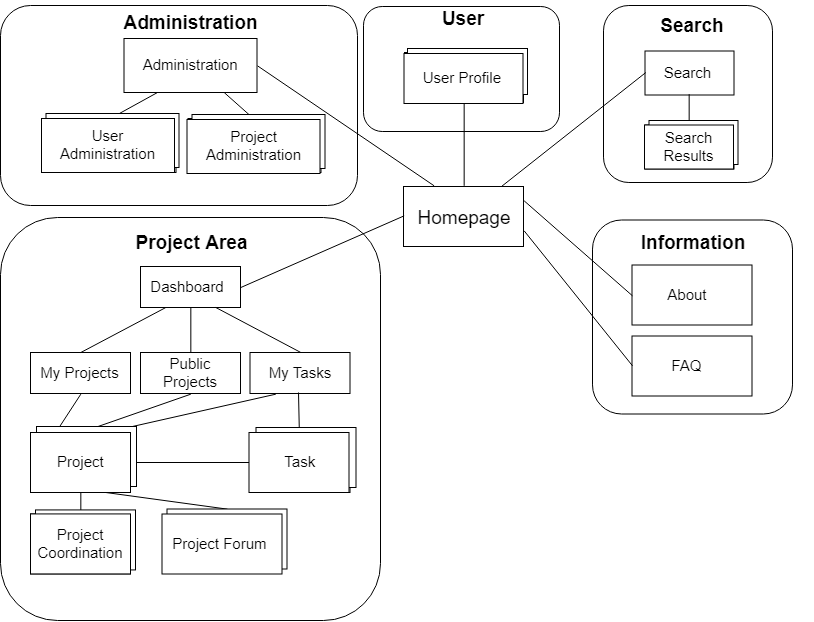

# A3: User Interface Prototype

## 1. Interface and common features

Figure 1: Homepage of PLENUM.
> Screenshots highlighting the main elements of the interface, for desktop and mobile.

## 2. Sitemap

Figure 1: Sitemap presenting the overall structure of the web application.

## 3. Storyboards

> Storyboards for the main use cases of the system.
> Do not include trivial use cases.

## 4. Interfaces

> Screenshots, structured in subsections, including a reference, a description and a URL to the working version.

### UI01: Home

### UI02: About

***

## Revision history

Changes made to the first submission:
1. Item 1
1. Item 2

***

GROUP1743, 05/03/2018

> Mateus Pedroza Cortes Marques, up201601876@fe.up.pt   
> Bernardo Manuel Costa Barbosa, up201503477@fe.up.pt   
> João Pedro Teixeira Pereira de Sá, up201506252@fe.up.pt   
> Mário Rui Macedo Flores dos Santos, up201503406@fe.up.pt  
