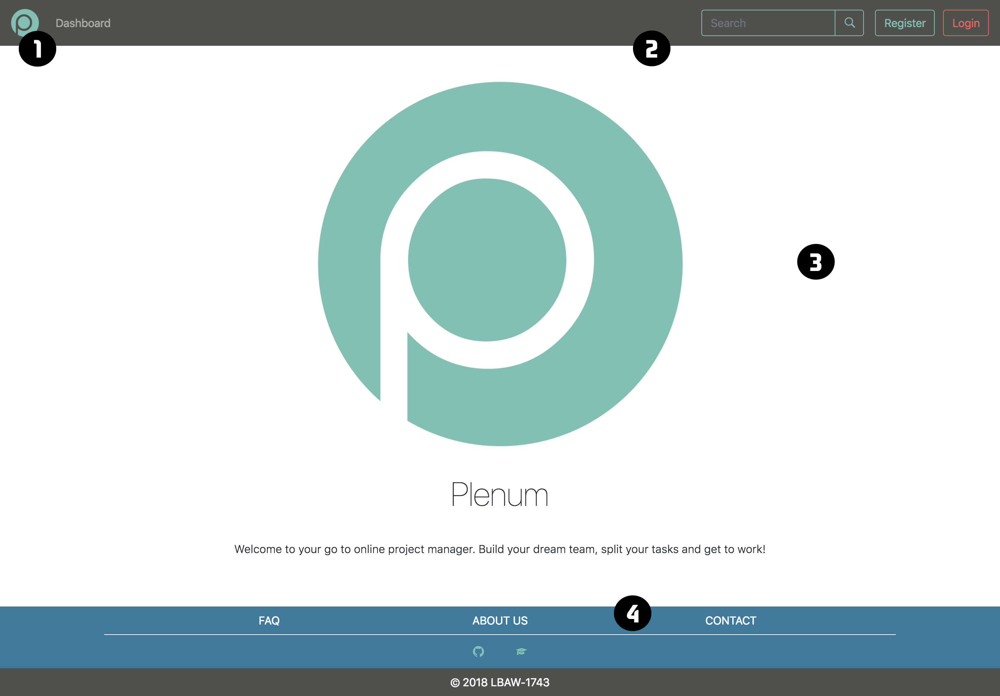

# A3: User Interface Prototype

This artifact contains the overview of the interface elements and features for our **Project Management** Web Application.

## 1. Interface and common features

**Plenum** is a web application based on HTML5, JavaScript and CSS. The user interface was implemented using the Bootstrap framework.

 

1.  Logo
2.  Navigation Bar
3.  Content
4.  Footer

Figure 1: Homepage of PLENUM.

In this figure some characteristics common to all the pages are highlighted:
- Color Scheme:
  - Dark Liver (#50514F);
  - Sunset Orange (#F25F5C);
  - Mustard (#FFE066);
  - Lapis Lazuli (#247BA0);
  - Green Sheen (#70C1B3);
- The common links to the various pages maintain their position to make the user experience consistent;
- User have the link to the dashboard, where he can view all his projects and tasks;
- Search any User, Project or Task;
- Responsive design to help user at any device (computer, tablet, smartphone, etc...).

## 2. Sitemap

Figure 1: Sitemap presenting the overall structure of the web application.

## 3. Storyboards

Figure 3: Log In from Home Page.

Figure 4: New Project from Dashboard.

Figure 5: Edit Profile from Dashboard.

Figure 6: Create Task from Dashboard.

## 4. Interfaces
### UI01: Homepage
 

Figure 7: [Homepage](https://paginas.fe.up.pt/~up201506252/index.php).

### UI02: FAQ:

Figure 8: [FAQ](https://paginas.fe.up.pt/~up201506252/faq.php).

### UI03: About:

Figure 9: [About](https://paginas.fe.up.pt/~up201506252/about.php).

### UI04: Contact:
 

Figure 10: [Contact](https://paginas.fe.up.pt/~up201506252/about.php).

### UI05: Log In:
 

Figure 11: Log In.

### UI06: Register:
 

Figure 12: Register.

### UI07: Dashboard:
 

Figure 13: [Dashboard](https://paginas.fe.up.pt/~up201506252/dashboard.php).

### UI08: Dashboard My Projects:
 

Figure 14: [Dashboard My Projects](https://paginas.fe.up.pt/~up201506252/dashboard_my_projects.php).

### UI09: Dashboard My Tasks:

Figure 15: [Dashboard My Tasks](https://paginas.fe.up.pt/~up201506252/dashboard_tasks.php).

### UI10: New Project:

Figure 16: New Project.

### UI11: Project Tasks:

Figure 17: [Project Tasks](https://paginas.fe.up.pt/~up201506252/project_tasks.php).

### UI12: Project Forum:

Figure 18: [Project Forum](https://paginas.fe.up.pt/~up201506252/project_forum.php).

### UI13: Project Members:

Figure 19: [Project Members](https://paginas.fe.up.pt/~up201506252/project_members.php).

### UI14: Project Options:

Figure 20: [Project Options](https://paginas.fe.up.pt/~up201506252/project_options.php).

### UI15: Project Manage Tasks:

Figure 21: [Project Manage Tasks](https://paginas.fe.up.pt/~up201506252/project_manage_tasks.php).

### UI16: Project Manage Users:

Figure 22: [Project Manage Users](https://paginas.fe.up.pt/~up201506252/project_manage_users.php).

### UI17: Task Page:

Figure 23: [Task Page](https://paginas.fe.up.pt/~up201506252/task_page.php).

### UI18: Edit Task:

Figure 24: [Edit Task](https://paginas.fe.up.pt/~up201506252/task_edit.php).

### UI19: Profile:
 

Figure 25: [Profile](https://paginas.fe.up.pt/~up201506252/profile.php).

### UI20: Edit Profile:

Figure 26: Edit Profile.

### UI21: Search by Projects:
 

Figure 27: [Search by Projects](https://paginas.fe.up.pt/~up201506252/search_projects.php).

### UI22: Search by Users:
 

Figure 28: [Search by Users](https://paginas.fe.up.pt/~up201506252/search_users.php).

### UI23: Search by Tasks:
 

Figure 29: [Search by Tasks](https://paginas.fe.up.pt/~up201506252/search_tasks.php).

### UI24: Administration Log In:
 

Figure 30: [Administration Log In](https://paginas.fe.up.pt/~up201506252/admin/index.php).

### UI25: Administration Manage Projects:

Figure 31: [Administration Manage Projects](https://paginas.fe.up.pt/~up201506252/admin/projects.php).

### UI26: Administration Manage Users:

Figure 32: [Administration Manage Users](https://paginas.fe.up.pt/~up201506252/admin/users.php).

### UI27: Error Page:
 

Figure 33: [Error Page](https://paginas.fe.up.pt/~up201506252/error.php).

***
<!-- ## Revision history

Changes made to the first submission:
1. Item 1
1. Item 2

*** -->

GROUP1743, 05/03/2018

> Mateus Pedroza Cortes Marques, up201601876@fe.up.pt   
> Bernardo Manuel Costa Barbosa, up201503477@fe.up.pt   
> João Pedro Teixeira Pereira de Sá, up201506252@fe.up.pt   
> Mário Rui Macedo Flores dos Santos, up201503406@fe.up.pt  
