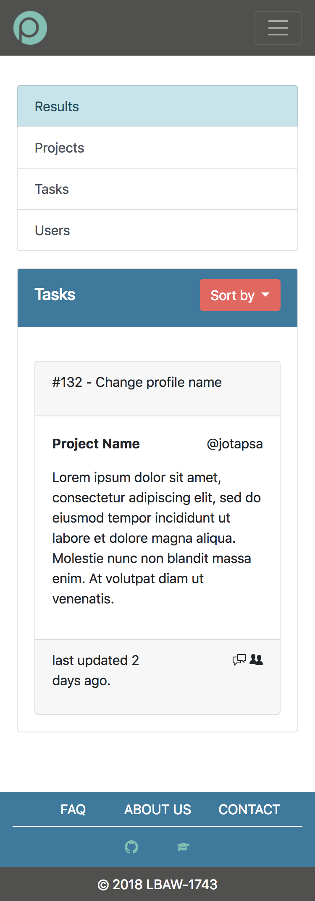

# A3: User Interface Prototype

This artifact contains the overview of the interface elements and features for our **Project Management** Web Application.

## 1. Interface and common features

**Plenum** is a web application based on HTML5, JavaScript and CSS. The user interface was implemented using the Bootstrap framework.

 

1.  Logo
2.  Navigation Bar
3.  Content
4.  Footer

Figure 1: Homepage of PLENUM.

In this figure some characteristics common to all the pages are highlighted:
- Color Scheme:
  - Dark Liver (#50514F)
  - Sunset Orange (#F25F5C)
  - Mustard (#FFE066)
  - Lapis Lazuli (#247BA0)
  - Green Sheen (#70C1B3)
- The common links to the various pages maintain their position to make the user experience consistent;
- User have the link to the dashboard, where he can view all his projects and tasks;
- Search any User, Project or Task;
- Responsive design to help user at any device (computer, tablet, smartphone, etc...).

## 2. Sitemap

Figure 1: Sitemap presenting the overall structure of the web application.

## 3. Storyboards

Figure 3: Log In from Home Page.

Figure 4: New Project from Dashboard.

Figure 5: Edit Profile from Dashboard.

Figure 6: Create Task from Dashboard.

## 4. Interfaces
### UI01: Homepage
 

Figure 7: [Homepage](https://mpcmarques.github.io/lbaw1743/).

### UI02: FAQ:
 

Figure 8: [FAQ](https://mpcmarques.github.io/lbaw1743/faq.html).

### UI03: About:
 

Figure 9: [About](https://mpcmarques.github.io/lbaw1743/about.html).

### UI04: Contact:
 

Figure 10: [Contact](https://mpcmarques.github.io/lbaw1743/contact.html).

### UI05: Log In:
 

Figure 11: Log In.

### UI06: Register:
 

Figure 12: Register.

### UI07: Dashboard:
 

Figure 13: [Dashboard](https://mpcmarques.github.io/lbaw1743/dashboard.html).

### UI08: Dashboard My Projects:
 

Figure 14: [Dashboard My Projects](https://mpcmarques.github.io/lbaw1743/dashboard_my_projects.html).

### UI09: Dashboard My Tasks:
 

Figure 15: [Dashboard My Tasks](https://mpcmarques.github.io/lbaw1743/dashboard_tasks.html).

### UI10: New Project:
 

Figure 16: [New Project](https://mpcmarques.github.io/lbaw1743/dashboard/new-project.html).

### UI11: Project Tasks:
 

Figure 17: [Project Tasks](https://mpcmarques.github.io/lbaw1743/project_tasks.html).

### UI12: Project Forum:
 

Figure 18: [Project Forum](https://mpcmarques.github.io/lbaw1743/project_forum.html).

### UI13: Project Members:
 

Figure 19: [Project Members](https://mpcmarques.github.io/lbaw1743/project_members.html).

### UI14: Project Options:
 

Figure 20: [Project Options](https://mpcmarques.github.io/lbaw1743/project_options.html).

### UI15: Project Manage Tasks:
 

Figure 21: [Project Manage Tasks](https://mpcmarques.github.io/lbaw1743/project_manage_tasks.html).

### UI16: Project Manage Users:
 

Figure 22: [Project Manage Users](https://mpcmarques.github.io/lbaw1743/project_manage_users.html).

### UI17: Task Page:
 

Figure 23: [Task Page]().

### UI18: Edit Task:
 

Figure 24: [Edit Task]().

### UI19: Profile:
 

Figure 25: [Profile]().

### UI20: Edit Profile:
 

Figure 26: Edit Profile.

### UI21: Search by Projects:
 

Figure 27: [Search by Projects]().

### UI22: Search by Users:
 

Figure 28: [Search by Users]().

### UI23: Search by Tasks:
 

Figure 29: [Search by Tasks]().

### UI24: Administration Log In:
 

Figure 30: [Administration Log In]().

### UI25: Administration Manage Projects:
 

Figure 31: [Administration Manage Projects]().

### UI26: Administration Manage Users:
 

Figure 32: [Administration Manage Users]().

### UI27: Error Page:
 

Figure 33: [Error Page]().

***
<!-- ## Revision history

Changes made to the first submission:
1. Item 1
1. Item 2

*** -->

GROUP1743, 05/03/2018

> Mateus Pedroza Cortes Marques, up201601876@fe.up.pt   
> Bernardo Manuel Costa Barbosa, up201503477@fe.up.pt   
> João Pedro Teixeira Pereira de Sá, up201506252@fe.up.pt   
> Mário Rui Macedo Flores dos Santos, up201503406@fe.up.pt  
