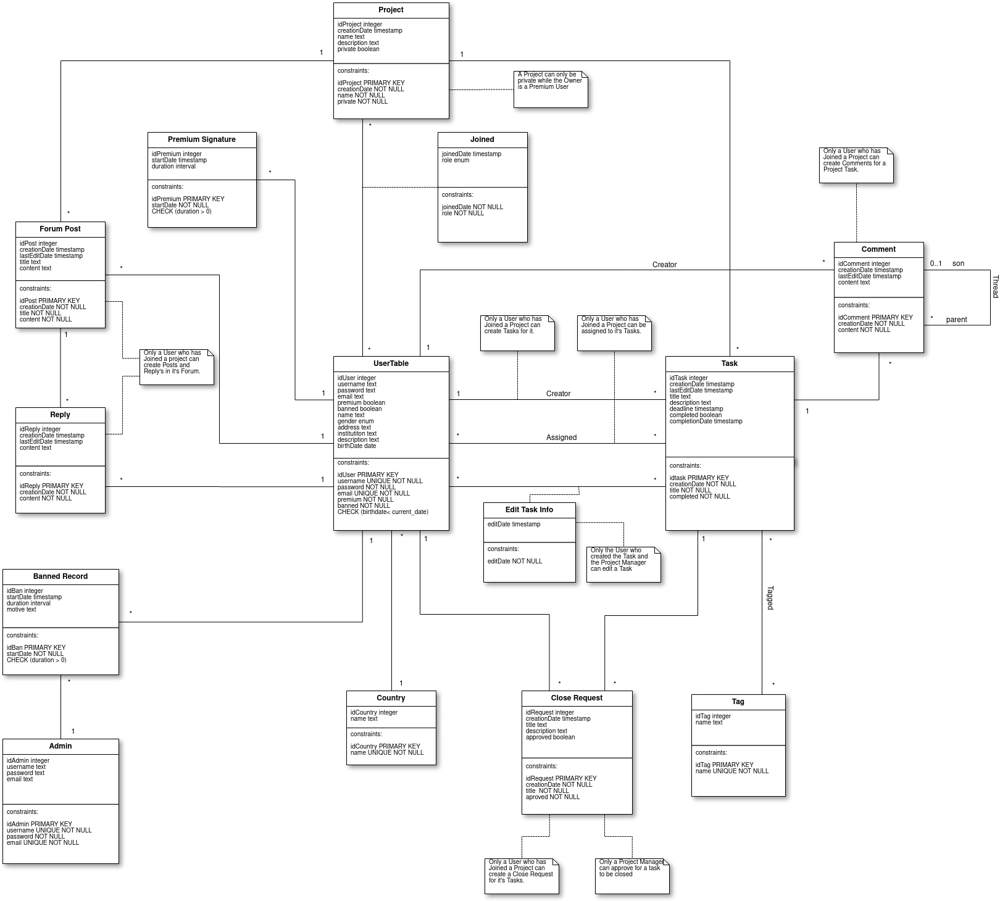

# A4: Conceptual Data Model

The Conceptual Domain Model contains the identification and description of the entities of the domain and the relationships between them in an UML class diagram representing our **Project Management** Web Application.

## 1. Class diagram

Figure 1: UML Class diagram.

<!--
## 2. Additional Business Rules

> Business rules can be included in the UML diagram as UML notes or in a table in this section.

| Identifier | Name | Description |
| :----------:|:-------------:|:-----------|
| BR01 | Register | To register, user must fill a register form with full name, nickname, e-mail, birthday, gender and institution (not required). |

-->

***
## Revision history

Changes made to the first submission:
1. Made Joined class a association class.
2. Added data types for all attributes.
3. Improved readability.
4. Removed both our subclasses for User and Task.
5. Created association classes for when a Task or a Comment is edited.
6. Fixed some constraints (e.g. Made the name attribute of the Country class unique).
7. Added some business rules (e.g. Close request).
8. Removed Reply self-association, but kept the Comment self-association.

***

GROUP1743, 18/03/2018

> Mateus Pedroza Cortes Marques, up201601876@fe.up.pt   
> Bernardo Manuel Costa Barbosa, up201503477@fe.up.pt   
> João Pedro Teixeira Pereira de Sá, up201506252@fe.up.pt   
> Mário Rui Macedo Flores dos Santos, up201503406@fe.up.pt  
